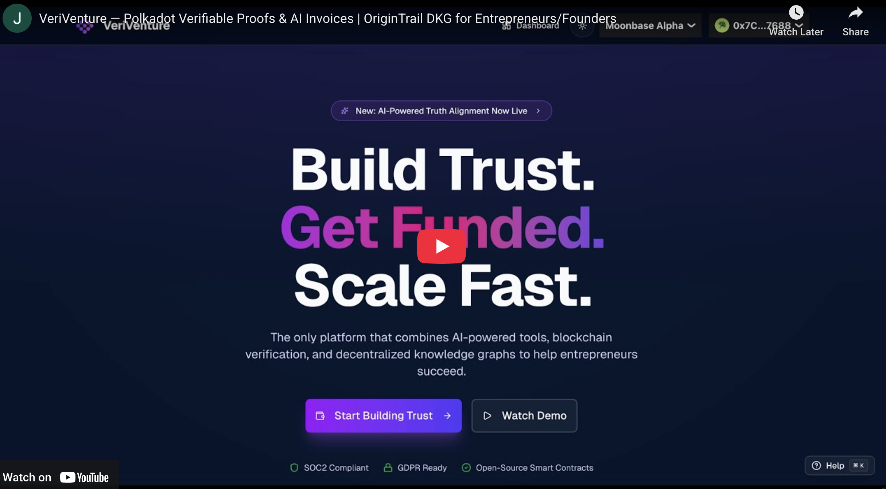

# VeriVenture — Get Paid, Get Trusted, Get Funded

[](https://veriventure.vercel.app/demo-video)

VeriVenture is the founder operating system that fuses wallet-only authentication, Moonbase Alpha smart contracts, OriginTrail DKG proofs, and applied AI copilots so entrepreneurs can get paid faster, defend every claim, and ship investor-grade collateral from a single workspace.

## Who we serve & why it matters
Founders and entrepreneurs lose weeks chasing invoice payments, rewriting pitch collateral, and proving traction to buyers or investors. VeriVenture replaces emails, PDF chains, and screenshots with verifiable workflows: invoices any wallet can settle, milestone badges minted on-chain, AI assistants that generate decks/plans/resumes, and a `/verify/[handle]` surface that shares the evidence in one click.

## Problem → Solution
| Pain experienced by founders | How VeriVenture solves it | Outcome |
| --- | --- | --- |
| Payment friction and disputes when buyers delay or question invoices | Invoice Registry contracts on Moonbase Alpha create open-payment invoices, show explorer links, and let issuers publish settlement proofs to OriginTrail DKG | Faster cash conversion and indisputable receipts founders can forward to lenders or partners |
| Diligence drag because teams can’t prove traction or milestone claims | Credentials mint achievements via ValidityRegistry, dashboards expose deterministic hashes, and Verify pages mirror them publicly | Reviewers self-serve proof without extra calls, so founders progress faster |
| Blank-page paralysis when creating decks, plans, resumes, or updates | Pitch Deck Studio, Business Plan Lab, Resume/Bio Builder, Social automation, and inline “Use AI” buttons generate ready-to-edit content tied to each wallet | Entrepreneurs spend time refining strategy instead of drafting from scratch |
| Confusion about AI-sourced facts and market claims | Truth Alignment Lab compares Grokipedia vs Wikipedia, surfaces divergences, and publishes a DKG Community Note with citations | Every bold claim links to a verifiable knowledge asset, boosting trust |
| Evidence scattered across apps | Documents vault, Notes workspace, and `/verify/[handle]` consolidate artifacts, hashes, explorer links, and DKG UALs | Founders maintain one canonical trust surface |

## Real-World Problem Research

Each challenge targeted by VeriVenture is grounded in evidence from government, multilateral, or academic sources. The table below summarizes the signal and the product response.

| Challenge | Evidence | Why it matters | VeriVenture response |
| --- | --- | --- | --- |
| SME financing gap | World Bank estimates a \$5.2T credit shortfall for 65M MSMEs worldwide ([MSME Finance Gap](https://www.worldbank.org/en/topic/smefinance/publication/msme-finance-gap)). | Entrepreneurs without standardized proof struggle to unlock loans or grants. | Wallet-signed `AchievementBadge` hashes and verification pages give lenders tamper-evident traction proof that aligns with sustainable business and financing goals. |
| Cyber resilience for small firms | CISA warns SMEs remain prime cyber targets and need verifiable controls ([Cyber Essentials](https://www.cisa.gov/resources-tools/services/cyber-essentials)). | Without trustworthy identity, AI copilots can leak or fabricate data. | Wallet-only auth and deterministic document checksums keep every AI artifact traceable, aligning with strong cybersecurity and user-centric design expectations. |
| Climate and sustainability pressure | IPCC AR6 shows SMEs are disproportionately exposed to climate disruptions without transparent impact reporting ([IPCC WGII Report](https://www.ipcc.ch/report/ar6/wg2/)). | Governments and corporates demand resilient, provable ESG action. | Milestone hashes and DKG Community Notes let founders publish climate claims with citations, supporting transparent climate and ESG reporting. |
| AI readiness & skills gap | Harvard Business Review notes most small businesses lack AI literacy despite demand for automation ([HBR: “How Small Businesses Can Benefit from AI”](https://hbr.org/2023/06/how-small-businesses-can-benefit-from-ai)). | Founders need turnkey copilots tied to their own data, not generic templates. | The AI Assistant (pitch decks, plans, resumes, social autoposting) reuses the same wallet-linked context and stores results in Convex for instant reuse. |
| Trust/alignment for AI agents | NIST’s AI Risk Management Framework stresses provenance + transparency for trustworthy AI ([NIST AI RMF](https://www.nist.gov/itl/ai-risk-management-framework)). | Reviewers and regulators require demonstrable alignment and provenance signals. | Truth Alignment Lab compares Grokipedia vs Wikipedia, quantifies similarity via OpenAI embeddings, and publishes JSON-LD Knowledge Assets on the OriginTrail DKG for agent-ready provenance. |

## How the build maps to three focus areas
1. **AI-first entrepreneurship programs** – VeriVenture delivers production copilots that live inside each workflow (credentials, invoices, decks, plans, resumes, social content). They reuse wallet context, respect per-field limits, and export to PDF/PPTX so founders receive immediate, business-ready materials that can be referenced in diligence.
2. **User-centered Web3 resilience initiatives** – Wallet-only auth via RainbowKit + wagmi, proxy-enforced session cookies, Convex-backed data, and smart contracts (ValidityRegistry + InvoiceRegistry) make the Web3 layer invisible to non-technical buyers. Every route exposes explorer links, DKG proof buttons, and `/demo-video` + `/pitch-deck` shortlinks powered by environment variables so marketing swaps need zero redeploys.
3. **Truth Alignment Lab focus** – The build incorporates the full Grokipedia vs Wikipedia analysis flow, AI embeddings, and automatic publishing to OriginTrail DKG for Community Notes and DKG Activity. Founders can cite a signed UAL for every claim, satisfying the Truth Alignment Lab brief without mentioning hackathon logistics.

## Feature map – what every screen delivers
The recorded walkthrough (mirrored via `/demo-video`) touches each of these routes and the public `/pitch-deck` shortlink shares the investor deck that aligns with the same flows.

| Route | Audience | Highlights |
| --- | --- | --- |
| `/` | Visitors | Hero CTA, trust-layer explainer, stats, quick jumps into the authenticated workspace |
| `/dashboard` | Authenticated founders | Wallet status, Quick Start onboarding, session-wide broadcasts, activity timeline fed by achievements/invoices |
| `/credentials` | Founders | Milestone form with per-field AI, BLAKE2b hash preview, `mintAchievementBadge` call, badge list with explorer + verify actions |
| `/invoices` | Issuers & payers | Tabs for issued/received, charts, settlement progress, create/view shortcuts |
| `/invoices/new` | Issuers | Optional payer wallet, DEV amount, due date, memo, open-payment guidance, explains automatic DKG proofs after payment |
| `/invoices/[id]` | Issuers & buyers | Pay/Cancel controls, explorer links, settlement proof publisher, issuance commits, revenue attestations, salted commits, trust timeline |
| `/documents` | Founders | Vault for every AI artifact (pitch decks, plans, resumes, social posts) with checksum copy, exports, and deterministic metadata |
| `/notes` | Teams | Wallet-scoped diligence notes, pinned research, investor call logs synced through Convex |
| `/ai-assistant` | Founders | Directory of copilots: Pitch Deck Studio, Business Plan Lab, Resume/Bio Builder, Truth Alignment Lab, DKG Activity |
| `/ai-assistant/pitch-deck` | Founders | Four-step wizard stored in localStorage, inline “Use AI”, per-field limits, template selection, manual/AI/web imagery toggles, `Generate Deck` action |
| `/ai-assistant/pitch-deck/[deckId]` | Founders | Deck workspace with preview rail, slide chips, stacked slides, inline AI corrections, manual/AI/web imagery controls, PDF/PPTX exports |
| `/ai-assistant/business-plan` | Founders | Field-level AI suggestions, optional “publish to DKG”, structured plan output saved to Documents |
| `/ai-assistant/resume` | Founders | Resume & bio builder with inline AI, print-style preview, PDF export, headshot option, per-wallet history |
| `/ai-assistant/truth` | Founders | Truth Alignment Lab: Grokipedia/Wikipedia ingestion, cosine comparisons, divergence view, publish to `/api/dkg/notes` |
| `/ai-assistant/dkg-test` | Founders & reviewers | Production DKG Activity list merging Truth Alignment Notes and AI exports with UAL/explorer/Subscan links |
| `/verify/[handle]` | Public reviewers | Share/copy handle, recompute hash, OriginTrail UAL viewer, NeuroWeb Subscan proofs, automatic redirect from `/verify/{wallet}` |
| `/demo-video` | Anyone | Redirects to the configured demo video URL for the YouTube/loom walkthrough |
| `/pitch-deck` | Anyone | Redirects to the configured public deck so investors can self-serve |

## End-to-end journey (plain English)
1. **Connect** – Visit the landing page, click Connect Wallet, sign the nonce from `/api/auth/challenge`, and land on the dashboard with the Quick Start checklist.
2. **Document real progress** – Record milestones in `/credentials`, click “Use AI” for narrative support, mint badges on-chain, and immediately view the explorer hash.
3. **Generate collateral** – Use the AI Assistant pages to create a pitch deck, business plan, and resume/bio. Each artifact lands in `/documents` with deterministic checksums and optional DKG publication.
4. **Invoice & get paid** – Create an invoice, leave the payer blank if you want open payments, and send the share link. Buyers can settle from any wallet and see explorer receipts instantly.
5. **Publish settlement proof** – Once paid, open the invoice detail page and publish the settlement proof + revenue attestation to OriginTrail so lenders and partners can validate the claim.
6. **Align external facts** – Run Truth Alignment Lab when referencing market or ESG data, compare sources, and publish a Community Note with its UAL so the statement is independently auditable.
7. **Share everything** – Distribute `/verify/[handle]`, `/demo-video`, and `/pitch-deck`; reviewers can click through blockchain transactions and DKG UALs without extra calls.

## Architecture & trust layer

```text
                +-----------------------------+
                |   Founder / Reviewer UI    |
                |  (Browser, RainbowKit UI)  |
                +-------------+---------------+
                              |
                              v
                    Next.js App Router
                 (React 19, shadcn/ui, API)
                              |
          +-------------------+-------------------+
          |                   |                   |
          v                   v                   v
   Convex Backend       Smart Contracts        AI Services
 (achievements, docs,   (Moonbase Alpha       (OpenAI via
 notes, invoices,       ValidityRegistry,      src/lib/
 pitchDecks, etc.)      InvoiceRegistry)     server/openai)
          |                   |                   |
          v                   v                   |
   DKG Assets & Notes   Tx Hashes & Events       |
      (OriginTrail      (explorer templates)     |
      via dkg.js)              |                 |
          |                    +--------+--------+
          v                             |
   DKG Explorer / Subscan               v
 (UALs, Subscan proofs)        Verify / Trust Surfaces
                               (/verify, DKG Activity)
```

- **Frontend** – Next.js App Router, shadcn/ui, TanStack Query/Table, React 19, Tailwind pipelines, deterministic theming.
- **Authentication** – RainbowKit + wagmi for wallet connect, `/api/auth/*` for nonce/signature, cookie-backed session refreshed via `proxy.ts`, and session broadcasts (`veriventure:session-updated`).
- **Data** – Convex tables for achievements, documents, notes, communityNotes, dkgAssets, pitchDecks, invoices, revenueAttestations. Deterministic hashing via `src/lib/achievement-hash.ts` and `createDocumentRecord` keeps proofs stable.
- **Smart contracts** – `ValidityRegistry` (soulbound milestones) and `InvoiceRegistry` (open-payment invoices, settlement telemetry) deployed to Moonbase Alpha; viem wrappers enable direct wallet interactions.
- **DKG integration** – `src/app/api/dkg/notes` + `src/lib/server/dkg-client.ts` use `dkg.js` to publish Community Notes and asset metadata to OriginTrail, returning UAL + NeuroWeb transaction URLs defined by environment templates.
- **AI layer** – `src/lib/server/openai.ts` orchestrates completions/embeddings for forms, Truth Alignment, and the AI copilots. `PITCH_DECK_IMAGE_SIZE` & `PITCH_DECK_SCRAPE_SIZE` control asset rendering.
- **Observability** – ESLint, `npm run typecheck`, tx hash captures, `/api/dkg/health`, deterministic exports, and the Verify page keep the production state auditable.

## Tech stack & command reference
- `npm run dev` – launch the Next.js workspace with wallet auth and live Convex sync.
- `npm run build` / `npm run start` – production build & start.
- `npm run lint`, `npm run typecheck`, `npm run lint:fix` – quality gates.
- `npm run build:contract` – compile the Hardhat contracts (see `blockchain/`).
- `npm run convex:dev`, `npm run convex:deploy`, `npm run convex:reset` – Convex workflows.

## Environment & configuration
1. Copy `.env.example` to `.env.local` and keep both files mirrored whenever values change.
2. Required values already ship with Moonbase Alpha defaults:
   ```ini
   NEXT_PUBLIC_EVM_RPC_URL=https://rpc.api.moonbase.moonbeam.network
   NEXT_PUBLIC_VALIDITY_REGISTRY_ADDRESS=0x9722f2276d8006A876Efba684eD6939cccc1eb41
   NEXT_PUBLIC_INVOICE_REGISTRY_ADDRESS=0x48dD1D5627E946b7D7226518B2e705D32Dc51d32
   NEXT_PUBLIC_EVM_NETWORK_NAME=Moonbase Alpha
   NEXT_PUBLIC_EXPLORER_TX_TEMPLATE=https://moonbase.moonscan.io/tx/{tx}
   NEXT_PUBLIC_DKG_VIEWER_TEMPLATE=https://dkg-testnet.origintrail.io/explore?ual={ual}
   NEXT_PUBLIC_DKG_TX_TEMPLATE=https://neuroweb-testnet.subscan.io/tx/{tx}
   NEXT_PUBLIC_SOCIAL_AUTOMATION_READY=false
   ```
3. Marketing redirects that power `/demo-video` and `/pitch-deck`: set `DEMO_VIDEO_URL` to the public recording you want prospects to watch and `PITCH_DECK_URL` to the shareable investor deck. Updating these environment variables immediately updates the shortlinks.
4. Fill out server-only secrets and signing keys: `OPENAI_API_KEY`, `AUTH_SECRET`, `DKG_NODE_ENDPOINT`, `DKG_NODE_PORT`, `DKG_ENV`, `DKG_BLOCKCHAIN_NAME`, `DKG_BLOCKCHAIN_RPC`, `DKG_BLOCKCHAIN_PRIVATE_KEY`, and any Convex deploy tokens. These values stay on the server and are validated by `src/env/server.ts` before boot.
5. Optional helpers: `CONVEX_RESET_TOKEN`, `GROKIPEDIA_BASE_URL`, `NEXT_PUBLIC_SOCIAL_AUTOMATION_READY`, `PITCH_DECK_IMAGE_SIZE`, etc.

## Setup & development workflow
1. **Install dependencies** – `npm install` (the repo pins Next.js 16, React 19, and Tailwind v4).
2. **Run Convex locally** – `npm run convex:dev` in a separate terminal to watch schema changes and regenerate `_generated` helpers.
3. **Compile contracts** – `npm run build:contract` (runs Hardhat via `blockchain/`). Deploy with your preferred Hardhat network and copy addresses into the env file if you change them.
4. **Start the app** – `npm run dev` and open [http://localhost:3000](http://localhost:3000). RainbowKit will request a wallet signature the first time you connect.
5. **Quality gates** – `npm run lint` and `npm run typecheck` before shipping changes. The Agent Playbook (AGENTS.md) must be updated alongside any route/flow adjustments.

## Data & privacy model
- **On-chain** – Only hashed achievements and invoice metadata live on Moonbase Alpha. No raw customer info is stored on-chain.
- **DKG** – Community Notes capture structured summaries with references; issuers pick what to publish, keeping sensitive docs private while still producing verifiable proofs.
- **Off-chain** – Convex stores documents, notes, onboarding progress, and AI artifacts. Deterministic hashes allow redaction without losing verifiability.
- **Sessions** – Wallet signatures gate all sensitive routes; `proxy.ts` refreshes cookies for `/dashboard`, `/credentials`, `/invoices`, `/ai-assistant`, `/documents`, and `/notes`.
